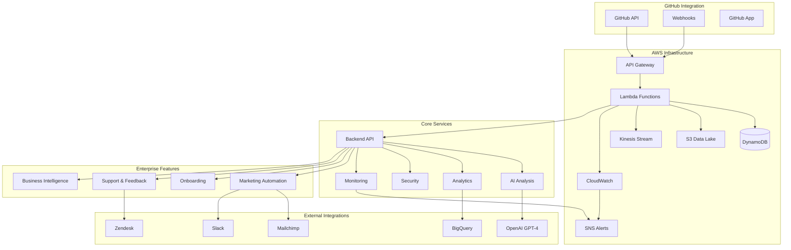

# Automerge-Pro Enterprise Architecture Documentation

## 🏗️ System Architecture Overview

Automerge-Pro is a comprehensive, industry-leading GitHub App ecosystem built on AWS serverless architecture with enterprise-grade features including AI-powered automation, advanced analytics, and comprehensive security.

### 🌟 Key Components

```
┌─────────────────────────────────────────────────────────────────┐
│                        AUTOMERGE-PRO                            │
│                    Enterprise Ecosystem                         │
└─────────────────────────────────────────────────────────────────┘
         │
         ├── 🔧 Core Backend (Node.js/Express + AWS Lambda)
         ├── 🤖 AI Analysis Engine (OpenAI GPT-4 Integration)
         ├── 📊 Advanced Analytics & BI Pipeline
         ├── 🔒 Enterprise Security & Compliance
         ├── 🚀 Marketing Automation Platform
         ├── 🎯 User Onboarding & Success
         ├── 💬 Support & Feedback System
         ├── 📈 Monitoring & Alerting
         └── 🛠️ Developer Tools & CLI
```

## 📋 Service Architecture Diagram



## 🚀 Core Services

### 1. Backend API (`apps/backend/`)

**Technology Stack:**
- **Runtime**: Node.js 18+ with TypeScript
- **Framework**: Express.js with Fastify integration
- **Deployment**: AWS Lambda with @vendia/serverless-express
- **Database**: DynamoDB with Prisma ORM
- **Authentication**: JWT + OAuth 2.0

**Key Features:**
- GitHub webhook processing
- AI-powered pull request analysis
- Configuration management
- License validation and feature gating
- RESTful API endpoints

### 2. Marketing Automation Service

**File**: `apps/backend/src/services/marketing-automation.ts`

**Capabilities:**
- **AI Content Generation**: Uses OpenAI GPT-4 to create social media posts
- **Multi-Platform Support**: LinkedIn, Twitter/X, Mastodon
- **Email Campaigns**: Mailchimp integration for drip campaigns
- **Case Study Generation**: Automated success stories from user data
- **README Updates**: Live badges and case study sections

**Workflow:**
```
Weekly Trigger → Analyze README/Changelog → Generate AI Content → Schedule Posts → Update Case Studies
```

### 3. User Onboarding Service

**File**: `apps/backend/src/services/onboarding.ts`

**Components:**
- **Interactive CLI Tool**: Bash script for guided repository setup
- **Web Dashboard**: React-style progress tracking interface
- **8-Step Flow**: Welcome → Install → Configure → Test → Advanced Features
- **Analytics**: Drop-off tracking and completion metrics
- **Automated Emails**: Milestone-based drip campaigns

### 4. Advanced Analytics & BI

**File**: `apps/backend/src/services/advanced-analytics.ts`

**Data Pipeline:**
```
Real-time Events → Kinesis → Lambda Processing → S3 Data Lake → BigQuery → QuickSight Dashboards
```

**Features:**
- **Real-time Processing**: Kinesis Analytics for immediate insights
- **Statistical Anomaly Detection**: Z-score based alerting
- **Predictive Analytics**: Churn prediction, usage forecasting
- **Business Intelligence**: Executive, product, and operational dashboards
- **Automated Reporting**: PDF reports with email delivery

### 5. Enterprise Security

**File**: `apps/backend/src/services/enterprise-security.ts`

**Security Features:**
- **OAuth 2.0 + OpenID Connect**: Multi-provider authentication
- **Role-Based Access Control (RBAC)**: Granular permissions
- **Automated Security Scanning**: Dependencies, code, infrastructure
- **Multi-Factor Authentication**: TOTP, SMS, email
- **Data Encryption**: KMS-based encryption at rest and in transit
- **Compliance Reporting**: SOC2, GDPR, ISO27001, HIPAA

### 6. Monitoring & Alerting

**File**: `apps/backend/src/services/monitoring.ts`

**Monitoring Stack:**
- **CloudWatch Integration**: Custom metrics and dashboards
- **Distributed Tracing**: AWS X-Ray for request flow
- **Multi-Channel Alerting**: SNS, Slack, Email
- **Health Checks**: Database, external services, performance
- **Anomaly Detection**: Statistical analysis with confidence scoring

### 7. Support & Feedback

**File**: `apps/backend/src/services/support-feedback.ts`

**Support Ecosystem:**
- **Zendesk Integration**: Automated ticket creation
- **AI Sentiment Analysis**: Feedback categorization
- **Support Dashboard**: Real-time KPIs and metrics
- **Weekly Summaries**: Automated stakeholder reports
- **Release Notes Generation**: AI-powered draft creation

## 🏗️ Infrastructure (AWS SAM)

**File**: `template.yaml`

### AWS Resources

| Resource | Type | Purpose |
|----------|------|---------|
| AutomergePro | Lambda Function | Main application handler |
| MarketingAutomationFunction | Lambda Function | Marketing automation worker |
| AnalyticsWorkerFunction | Lambda Function | Analytics processing |
| SecurityScannerFunction | Lambda Function | Security scanning automation |
| AutomergeProApi | API Gateway | HTTP API endpoints |
| LicenseTable | DynamoDB | License and subscription data |
| FeedbackTable | DynamoDB | Support feedback storage |
| OnboardingTable | DynamoDB | User onboarding progress |
| AnalyticsKinesisStream | Kinesis Stream | Real-time analytics events |
| DataLakeBucket | S3 Bucket | Analytics data storage |
| AnalyticsKMSKey | KMS Key | Data encryption |
| CriticalAlertsTopicSNS | SNS Topic | Alert notifications |

### Deployment Architecture

```
GitHub Actions → AWS SAM Build → S3 Artifacts → CloudFormation Stack → Lambda Deployment
```

**Blue-Green Deployment:**
- Zero-downtime deployments
- Automatic rollback on failures
- Health checks and smoke tests
- Traffic switching with validation

## 🔄 CI/CD Pipeline

**File**: `.github/workflows/production-deploy.yml`

### Pipeline Stages

1. **Quality Assurance**
   - TypeScript compilation
   - ESLint code linting
   - Jest unit and integration tests
   - Code coverage reporting

2. **Security Scanning**
   - Dependency vulnerability scan (npm audit)
   - Snyk security analysis
   - GitHub CodeQL scanning
   - OWASP ZAP penetration testing

3. **Build & Package**
   - Production build
   - Lambda deployment package creation
   - Artifact versioning and storage

4. **Infrastructure Validation**
   - CloudFormation template validation
   - CFN-Lint infrastructure checks
   - Checkov security scanning

5. **Deployment**
   - Staging environment deployment
   - Production blue-green deployment
   - Health checks and validation
   - Automatic rollback on failures

## 🛠️ Developer Tools

### Enterprise CLI Tool

**File**: `cli/automerge-pro-cli.js`

**Commands:**
- `automerge-pro quickstart` - Quick setup wizard
- `automerge-pro config init` - Advanced configuration
- `automerge-pro health` - System health check
- `automerge-pro auth login` - API authentication
- `automerge-pro docs` - Documentation access

**Features:**
- Interactive configuration generation
- Real-time validation
- Health diagnostics
- Integration testing
- License management

## 📊 API Endpoints

**File**: `apps/backend/src/routes/enterprise.ts`

### Marketing Automation
- `POST /api/marketing/social-posts/generate` - Generate social media content
- `POST /api/marketing/email-campaign` - Create email campaigns
- `POST /api/marketing/case-study` - Generate case studies

### User Onboarding
- `POST /api/onboarding/initialize` - Start user onboarding
- `POST /api/onboarding/complete-step` - Complete onboarding step
- `GET /api/onboarding/dashboard/:userId` - Web dashboard
- `GET /api/onboarding/cli-script` - CLI setup script

### Analytics & BI
- `POST /api/analytics/event` - Track analytics events
- `GET /api/analytics/insights/predictive` - Predictive insights
- `GET /api/analytics/dashboards` - BI dashboards

### Security
- `POST /api/security/authenticate` - OAuth authentication
- `POST /api/security/scan` - Security scanning
- `POST /api/security/mfa/setup` - Multi-factor authentication
- `GET /api/security/compliance/:framework/:orgId` - Compliance reports

### Support & Feedback
- `POST /api/support/feedback` - Submit feedback
- `GET /api/support/dashboard` - Support dashboard
- `GET /api/support/analytics` - Feedback analytics
- `GET /api/support/release-notes/draft` - Auto-generated release notes

### Enterprise Dashboard
- `GET /api/enterprise/dashboard` - Unified enterprise dashboard

## 🔒 Security Architecture

### Authentication Flow
```
User → OAuth Provider → JWT Token → API Gateway → Lambda → RBAC Check → Resource Access
```

### Data Protection
- **Encryption at Rest**: KMS-encrypted DynamoDB and S3
- **Encryption in Transit**: TLS 1.3 for all communications
- **Key Management**: AWS KMS with automatic key rotation
- **Access Control**: IAM roles with least-privilege principles

### Compliance Features
- **Audit Logging**: Tamper-evident audit trails
- **Data Retention**: Configurable retention policies
- **Privacy Controls**: GDPR-compliant data handling
- **Security Scanning**: Automated vulnerability detection

## 📈 Analytics & Monitoring

### Real-Time Analytics Pipeline
```
Events → Kinesis Stream → Lambda Processing → Real-time Dashboard
                      ↓
                  S3 Data Lake → BigQuery → Business Intelligence
```

### Key Metrics
- **Application Performance**: Response time, throughput, error rates
- **Business Metrics**: User engagement, feature adoption, revenue
- **Security Metrics**: Vulnerability counts, compliance scores
- **Support Metrics**: Ticket volume, resolution time, satisfaction

### Alerting Strategy
- **Critical Alerts**: Immediate SNS + Slack notifications
- **Warning Alerts**: Email notifications with 15-minute delay
- **Info Alerts**: Dashboard updates only
- **Anomaly Detection**: Statistical analysis with confidence thresholds

## 🚀 Deployment Guide

### Prerequisites
- AWS Account with appropriate permissions
- Node.js 18+
- AWS SAM CLI
- GitHub App credentials

### Quick Deployment
```bash
# Clone repository
git clone https://github.com/MichaelWBrennan-Org/Automerge-Pro.git
cd Automerge-Pro

# Install dependencies
npm install

# Configure AWS credentials
aws configure

# Deploy to staging
sam deploy \
  --template-file template.yaml \
  --stack-name automerge-pro-staging \
  --parameter-overrides Stage=staging \
  --capabilities CAPABILITY_IAM

# Deploy to production
sam deploy \
  --template-file template.yaml \
  --stack-name automerge-pro-production \
  --parameter-overrides Stage=prod \
  --capabilities CAPABILITY_IAM
```

### Environment Variables

| Variable | Description | Required |
|----------|-------------|----------|
| `APP_ID` | GitHub App ID | Yes |
| `PRIVATE_KEY` | GitHub App Private Key | Yes |
| `WEBHOOK_SECRET` | GitHub Webhook Secret | Yes |
| `OPENAI_API_KEY` | OpenAI API Key | No |
| `MAILCHIMP_API_KEY` | Mailchimp API Key | No |
| `SNYK_TOKEN` | Snyk Security Token | No |
| `ALERT_EMAIL` | Alert notification email | No |

## 📚 Additional Resources

- **API Documentation**: Auto-generated OpenAPI specs
- **Security Whitepaper**: Detailed security analysis
- **Compliance Guide**: Framework-specific implementation guides
- **Performance Benchmarks**: Load testing results and optimization guides
- **Troubleshooting Guide**: Common issues and solutions

## 🔄 Maintenance & Operations

### Regular Maintenance Tasks
- **Weekly**: Review security scan results
- **Monthly**: Update dependencies and security patches
- **Quarterly**: Compliance audits and policy reviews
- **Annually**: Architecture review and capacity planning

### Monitoring Checklist
- [ ] Application health checks passing
- [ ] Error rates within acceptable thresholds
- [ ] Security scans show no critical vulnerabilities
- [ ] Performance metrics meeting SLA requirements
- [ ] Backup and disaster recovery tested

---

*This documentation is automatically updated with each release. For the latest version, visit [automerge-pro.dev/docs](https://automerge-pro.dev/docs).*